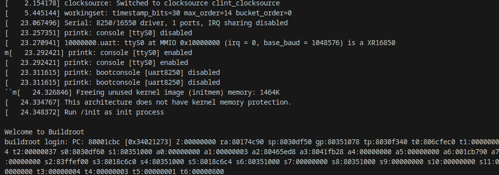

# gpunix

Welcome to gpunix, a fully-fledged Linux operating system that runs on the GPU. (Yes, you read that correctly)

As the great philosopher Richards Shaderman once said: 

> I'd just like to interject for a moment. What you're referring to as Unix, is in fact, GPU/Unix, or as I've recently taken to calling it, GPU plus Unix. Unix is not an operating system unto itself, but rather another component of a fully functioning GPU system made useful by the GPU kernels, memory management, and parallel processing capabilities comprising a full computational framework.

## Project Overview

> 
> The first boot of `gpunix` ever!

`gpunix` originally started an esoteric project to port the beloved Unix operating system (xv6) to run exclusively on CUDA-enabled devices. Eventually, the thing got out of hand and I ended up running a fully-fledged Linux distro instead. Whoops!

The project uses [`mini-rv32ima`](https://github.com/cnlohr/mini-rv32ima) to emulate a RISC-V CPU on the GPU (strange loop abounds? [Nvidia already uses RISC-V for their new GPUs](https://riscv.org/wp-content/uploads/2024/12/Tue1100_Nvidia_RISCV_Story_V2.pdf)) The CPU is then used to run a Linux kernel, which in turn runs a full userland.

Tested on a GTX 1060, CUDA compute capability 6.1 (`sm_61`).

## Features

- Absolute exploitation of CUDA's "supposed" turing completeness.
- Embrace the power of CUDA with familiar *nix commands.
- Experience the joy of debugging Linux on a GPU.
- ???
- Profit!

## Getting Started

To get started with `gpunix`, follow these steps:

1. Clone the repository: `git clone https://github.com/your-username/gpunix.git`
2. Install the necessary CUDA runtime and drivers. [Here](https://rpmfusion.org/Howto/CUDA) is a good guide for Fedora.
3. Build: `make cuda-rv32ima`
4. Launch: `./bin/cuda-rv32ima -f assets/DownloadedImage`
5. Enjoy hearing your GPU scream!

## TODO

- [ ] Fix up keyboard input
- [ ] Write up a blog post about the project

## License

This project is licensed under the [MIT License](LICENSE).

## Disclaimer

Please note that gpunix is an experimental project and should not be used in production environments. I don't even know how that would be possible, to be honest. Use at your own risk!
